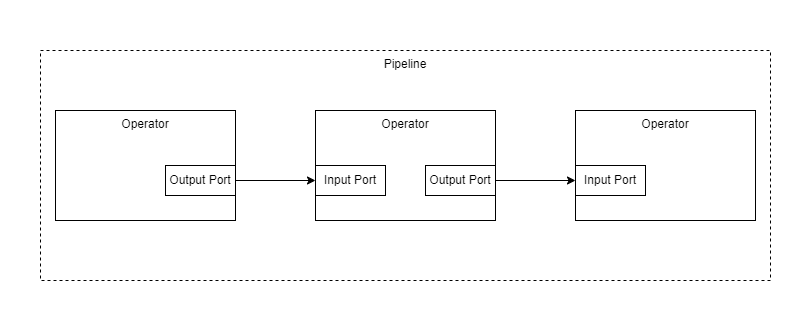

============
Introduction
============

- structure
- instances
- interfaces
- expected parameters
- parameters, templates, cascading
- yaml
- ports
- channels
- executor
 - operator executor
 - pipeline executor

how-to
- develop operator
- develop plugin
- develop port/channel
- design pipeline
- execute operator
- execute pipeline locally
- use sniffer
