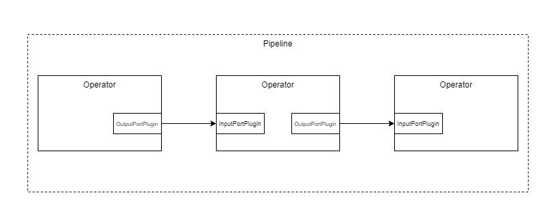

.. _data_transfer:

Data transfer
=============

Data transfer between operations in a pipeline is essential, without it we would speak about workflows.
In *pypz* data transfer is possible between operators through so called *ports*.

   Basic pipeline

Ports
-----

An input and output port in *pypz* is an actual implementation of the corresponding interfaces:

.. inheritance-diagram::
   pypz.core.specs.plugin.InputPortPlugin
   pypz.core.specs.plugin.OutputPortPlugin
   :parts: 1
   :caption: Inheritance diagram

Basically, you are free to implement any technology behind ports as long as you comply to the interfaces.

.. autoclass:: pypz.core.specs.plugin.InputPortPlugin
   :members:
   :no-index:

.. autoclass:: pypz.core.specs.plugin.OutputPortPlugin
   :members:
   :no-index:

.. important::
   Note that although *pypz* has a lot of builtin guards and trails to ensure execution stability,
   it does not have quality guarantees for custom interface implementations i.e., *pypz* will not
   take responsibility to any damage caused during execution of a custom plugin.

Channels
--------

During implementing the data transfer logic behind the port interfaces, you might encounter some challenges, which
takes more time to solve or even forces repetitive activities. For that reason *pypz* offers you an alternative
view on how data can be transferred across ports.

.. note::
   The following feature is completely independent from ports, you can consider as an extension to it, which
   you might use or not use. However, *pypz*'s implemented port plugins are based on this feature.

In *pypz*'s view, each connection between ports can/shall be isolated. Such a connection can be represented
as a *channel*.

   Pipeline with ports and channels

Actually, in the reality the channel is a virtual model, it exists due to the fact, that there is a resource
somewhere, where the data is written to and read from. The actual functionality is put into so called channel
readers and channel writers.

   ChannelReader/-Writer

Channels provide a solution to the following challenges:

- channel/connection state management and transfer i.e., ports are aware of other ports' states
- continuous health checks i.e., ports are aware, if other port is down
- instance group handling i.e., if the operator is :ref:`replicated <operator_replication>`, the channel gets this information
- automatic metrics calculation

If you want to utilize channels, then you shall implement the abstract methods of the corresponding classes
instead of the port interfaces.

.. autoclass:: pypz.core.channels.io.ChannelReader

   .. automethod:: _load_input_record_offset
   .. automethod:: has_records
   .. automethod:: _read_records
   .. automethod:: _commit_offset

.. autoclass:: pypz.core.channels.io.ChannelWriter

   .. automethod:: _write_records

.. note::
   Notice that the abstract methods a protected and shall not be called directly. The channel classes are providing
   invoker methods that will invoke the protected methods along with other code that abstracts a lot of complexity
   for you. For more information, check the code.

The question is, how to use the implemented channels. If you think carefully, you will notice that it is always the
same pattern:

1. create the necessary resources
2. open the channels
3. etl. wait for other connected channels
4. start the transmission
5. close the channels
6. clean up resources

To unload you creating boilerplate code every time, *pypz* provides an abstract implementation of the input and
output port plugin, which takes care all of these steps, so at the end you just need to provide the channel
implementation, everything else will be taken care of.

.. note::
   *pypz* ships with a channel implementation for Kafka

ChannelInputPort, ChannelOutputPort
-----------------------------------

This is a builtin implementation of the InputPortPlugin and OutputPortPlugin interface that integrates
channels into *pypz*. It provides all the necessary method calls of the channels to perform data transmission.

.. inheritance-diagram::
   pypz.abstracts.channel_ports.ChannelInputPort
   pypz.abstracts.channel_ports.ChannelOutputPort
   :parts: 1
   :caption: Inheritance diagram

Notice that both plugins are implementing the `ResourceHandlerPlugin` interface as well, which allows to
create and delete resources for the channels.

.. note::
   Note that it is not mandatory to use this plugin. If you have a better idea, how to integrate channels
   into *pypz*, feel free to implement it.

Although `ChannelOutputPort` and `ChannelInputPort` have an N-to-M relation, there is an N-to-1 relation on channel level
i.e., a `ChannelOutputPort` will create as many `ChannelWriters` as many `ChannelInputPort`
is connected, but the `ChannelInputPort` creates only one `ChannelReader`.

   ChannelWriter-ChannelReader N-1

The reason is that from `ChannelInputPort` perspective you have certain expectations w.r.t. records, so there
is no reason to create different `ChannelReader` entities, because all the `ChannelWriters` shall meet your
expectations. In other words, by invoking the `retrieve()` method on the `InputPortPlugin`, you will then get all the
records from all the outputs anyhow. This means as well that you need to manually care for ordering, if you have
such a requirement.

Further information:

- if an operator is :ref:`replicated <operator_replication>`, then it forms an :ref:`instance group <instance_group>`;
  only group principals can manage resources, replicas cannot
- in case of error **resources WILL NOT be deleted**, this feature ensures that in case the principal instance crashes,
  it can restart and continue the work without deleting the resources containing the already transmitted records
- in shutdown phase it is made sure that all channels have at least one attempt to shut down itself even it a previous
  channel threw an exception

.. _channel_expected_parameters:

Expected Parameters
+++++++++++++++++++

ChannelInputPort:

- **channelLocation**, location of the channel resource
- **channelConfig**, configuration of the channel as dictionary (default: {})
- **sequentialModeEnabled**, if set to True, then this port will wait with the processing start until all the
  connected output ports are finished (default: False)
- **portOpenTimeoutMs**, specifies, how long the port shall wait for incoming connections; 0 means no timeout (default: 0)
- **syncConnectionsOpen**, if set to True, the port will wait for every expected output ports to be connected (default: False)

ChannelOutputPort:

- **channelLocation**, location of the channel resource
- **channelConfig**, configuration of the channel as dictionary (default: {})
- **portOpenTimeoutMs**, specifies, how long the port shall wait for incoming connections; 0 means no timeout (default: 0)

.. note::
   As mentioned, the parameter "channelConfig" is a dictionary. The base channel class is providing the
   following parameters:

   - **metricsEnabled**, if set to True, then some metrics will be calculated and logged (default: False)
   - **logLevel**, specifies the log level for the channel (default: "DEBUG")

   Different channel implementations may require additional configuration. Example set channel configuration parameter:

   .. code-block:: python

      plugin.set_parameter("channelConfig", {"metricsEnabled": True})