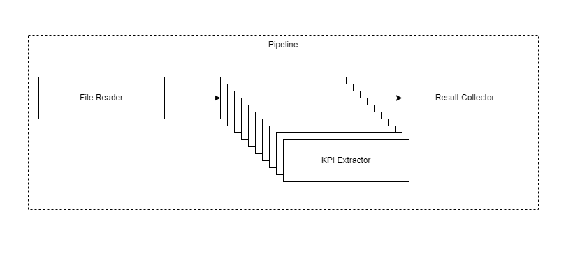

.. _models:

Models
======

There is a multi-layered design behind *pypz* with the following layers from top to bottom: pipeline,
operator, plugin. As you can see, in the top layer there is the pipeline, which contains the operators
with the actual business logic. It is possible to enhance the functionalities of the operators via
plugins e.g., the port plugins by which the operators can transfer data between each other or the
logger plugins that enables the operator to send logs to the specified targets. The plugins are on the lowest level.

.. figure:: ../resources/images/basic_pipeline.png
   :alt: Basic pipeline
   :align: center

   Basic pipeline

.. _instances:

Instances
---------

Each entities in *pypz* (pipelines, operators, plugins) are represented as instances in runtime.
The blueprints of the instances are called specs and are represented as classes in the code.
In other words, you can consider the specs as the classes and the instances as the objects
created from the classes. This design enables *pypz* to model the pipelines as code.
The :class:`Instance <pypz.core.specs.instance.Instance>` class itself is the base for
every other specs. It contains all the necessary logic and feature that is required by the mentioned design.

.. _inheritance_diagram:

.. inheritance-diagram::
   pypz.core.specs.pipeline.Pipeline
   pypz.core.specs.operator.Operator
   pypz.core.specs.plugin.LoggerPlugin
   pypz.core.specs.plugin.ExtendedPlugin
   pypz.core.specs.plugin.ServicePlugin
   pypz.core.specs.plugin.InputPortPlugin
   pypz.core.specs.plugin.OutputPortPlugin
   :parts: 1
   :caption: Inheritance diagram

The :class:`Instance <pypz.core.specs.instance.Instance>` class is designed in a way that it could
be used on its own. However, the :class:`Pipeline <pypz.core.specs.pipeline.Pipeline>`,
:class:`Operator <pypz.core.specs.operator.Operator>` and :class:`Plugin <pypz.core.specs.plugin.Plugin>`
classes are specializing and somewhat restricting the base Instance class in a way that is necessary for *pypz*.

Attributes
++++++++++

Basically an instance has the following attributes:

- **name** (required), which identifies the instance in runtime
- parameters
- **dependencies** to other instances
- **nested instances** i.e., other instances attached to the current instance's context e.g., an operator is a nested instance to a pipeline
- **context instance** i.e., the parent instance e.g., the pipeline is the context of an operator

.. note::
   The name of the instance can be provided either as constructor argument or if it has a context and
   the argument is omitted, then the name of instance will be the name of the variable.

Generic Type
++++++++++++

The :class:`Instance <pypz.core.specs.instance.Instance>` class is a generic class, where the generic attribute
describes the expected type of the nested instances. It is important, since at construction time all
attributes will be scanned and if one of them has the type of the expected nested instance type, then
it will be automatically identified as a nested instance.

.. _instance_metaclass:

Metaclass
+++++++++

Notice that a custom metaclass is used (:class:`pypz.core.specs.instance.InterceptedInstance`)
to be able to intercept the creation of the Instance object. This is necessary to allow to perform potential
instance name deduction from variable name and some other checks.

Dependencies
++++++++++++

It is possible to define dependencies between instances at runtime. However, you should be aware
that the meaning of the dependencies are defined by the runtime context i.e., just by defining
them has no effect. For example, the operator executor uses the dependency definitions of the plugins to
build a call order list, which then will determine, what plugin runs when.

Parameters
++++++++++

You can define expected parameters for your :class:`Instance <pypz.core.specs.instance.Instance>` spec.
You can expect both required and optional parameters to be set for your instance.
Check the :ref:`parameters section <parameters>` for a more detailed explanation.

Data Transfer Object (DTO)
++++++++++++++++++++++++++

If you want to transfer instances to outside of the current process, you need to convert it
into a representation, which can then be serialized. This representation is an additional
model called the DTO. By having an intermediate model, we can ensure that only those information
are transmitted that is really necessary to be able to reconstruct an instance object.

To get the DTO of an Instance, you can use:

:meth:`pypz.core.specs.instance.Instance.get_dto`

To construct an Instance object from a DTO, you can use:

:meth:`pypz.core.specs.instance.Instance.create_from_dto`

Working with YAML
~~~~~~~~~~~~~~~~~

Currently *pypz* serializes the DTOs into YAML, since it is human readable and provides features
out of the box, which JSON lacks the support of (e.g., interpreting sets).

To convert an instance into a YAML string, you can use:

.. code-block:: python

   yaml_string = str(instance)

In the background, the instance will be converted into a DTO, which then will be converted into a YAML string.

To construct an instance from a YAML string, you can use:

:meth:`pypz.core.specs.instance.Instance.create_from_string`

You can find a usage example `here <https://github.com/lazlowa/pypz-examples>`_

.. _instance_group:

Instance Groups
+++++++++++++++

Instances can be grouped together. For example, if you :ref:`replicate <operator_replication>` an operator, then
you are creating a group of operators. The original instance in this case is called "principal".

The class :class:`pypz.core.specs.instance.InstanceGroup` provides the methods to access useful group related information.

.. note::
   Notice that this interface shall be implemented by the instance types that can form groups e.g. Operator and Plugin.

Pipeline
--------

As its name suggests, the :class:`Pipeline <pypz.core.specs.pipeline.Pipeline>` class represents a
pipeline in *pypz*. Its nested type is defined as the :class:`Operator <pypz.core.specs.operator.Operator>` class.
Basically it does not alter or extend the functionality of the :class:`Instance <pypz.core.specs.instance.Instance>`
class, since unlike the operators and plugins, the pipeline is a virtual organization of the Operators.

Operator
--------

The :class:`Operator <pypz.core.specs.operator.Operator>` class represents the operator in *pypz*.
Its nested type is defined as the :class:`Plugin <pypz.core.specs.plugin.Plugin>` class.
The :class:`Operator <pypz.core.specs.operator.Operator>` is the most important model, since it contains
the implementation of the business logic. In addition to the :class:`Instance <pypz.core.specs.instance.Instance>`
class, the Operator class provides the following features:

- :ref:`operator connection <operator_connection>`
- :ref:`operator replication <operator_replication>`
- :ref:`methods <operator_methods>` to implement the business logic
- :ref:`operator logging <operator_logging>`

Expected Parameters
+++++++++++++++++++

A more detailed explanation about the expected parameters can be found in :ref:`parameters section <parameters>`.
This section presents only the expected parameters of the Operator instances.

*operatorImageName* (default: None)
~~~~~~~~~~~~~~~~~~~~~~~~~~~~~~~~~~~

The name of the Docker image, where you included the implemented Operator. This will mainly be used by the
container related deployers.

*replicationFactor* (default: 0)
~~~~~~~~~~~~~~~~~~~~~~~~~~~~~~~~

This value will determine, how many replicas shall be created from an operator.

Check `operator replication <operator_replication>` for more information.

.. _operator_connection:

Connections
+++++++++++

You can connect operators by the so called port plugins
(:class:`InputPortPlugin <pypz.core.specs.plugin.InputPortPlugin>`,
:class:`OutputPortPlugin <pypz.core.specs.plugin.OutputPortPlugin>`).

The connection can be defined on pipeline level, where you shall specify, which operator's which port plugin
shall be connected to which other operator's which port plugin.

.. code-block:: python

   class WriterOperator(Operator):
       def __init__(self, name: str = None, *args, **kwargs):
           super().__init__(name, *args, **kwargs)
           self.output_port = OutputPortPlugin()

   class ReaderOperator(Operator):
       def __init__(self, name: str = None, *args, **kwargs):
           super().__init__(name, *args, **kwargs)
           self.input_port = InputPortPlugin()

   class CustomPipeline(Pipeline):
       def __init__(self, name: str, *args, **kwargs):
           super().__init__(name, *args, **kwargs)

           self.reader_operator = ReaderOperator()
           self.writer_operator = WriterOperator()

           self.reader_operator.input_port.connect(self.writer_operator.output_port)

Check :ref:`data_transfer` for more details.

.. _operator_replication:

Replication
+++++++++++

Let's take the following pipeline as example:

.. figure:: ../resources/images/sample_pipeline_wo_replication.png
   :alt: Without replication
   :align: center

   Without replication

The first operator reads the files from some share, the second operator performs
some KPI extraction and the third operator aggregates the results and stores
in some database.

If there is 1 million files and the KPI extraction takes 1 second for each
file then it takes ~11.5 days to go through all the files. This is why *pypz*
provides the feature of operator replication. This enables a selective scaling
in the pipeline. For example, let's replicate the KPI extractor operator 99x,
which will result in total 100 operator (original + replicas):

   With replication

The output of the FileReader operator will distribute the files evenly across
all the processor operator, hence those will share the load, which will result
appr. 100x faster execution. This results ~2.7 hours for the entire set instead
of 11.5 days.

Based on your capacities, you can go even higher with the replication to reduce even more the processing time.

Replication at its core means that a *pypz* creates an Instance based on the following rules:

- the replica instance has the same type (class) as the original
- the original and the replica instances are forming a group, where the original is called principal
- each replica has a permanent index attached to it, which is visible in the name of the instance e.g.,
  if the original operator's name is 'inst' then the first replica's name is 'inst_0'
- to ensure consistency across instances all the attributes of the original operator is shared with the
  replicas like parameters, connections, etc.

.. note::
   Note that the concept of replications differs from scaling in a way that with setting the replication
   factor, you are creating copies of the original. A replication factor of 0 does not delete the original,
   it just does not create additional copies.

.. _operator_methods:

Methods
+++++++

The :class:`Operator <pypz.core.specs.operator.Operator>` class provides methods to implement your business logic.
Each method is called in specific order based on the :ref:`executor <executor>` implementation.

- :meth:`_on_init() <pypz.core.specs.operator.Operator._on_init>`
- :meth:`_on_running() <pypz.core.specs.operator.Operator._on_running>`
- :meth:`_on_shutdown() <pypz.core.specs.operator.Operator._on_shutdown>`

.. _operator_logging:

Logging
+++++++

Although the logging functionality is provided by the :class:`LoggerPlugin <pypz.core.specs.plugin.LoggerPlugin>` class,
the :class:`Operator <pypz.core.specs.operator.Operator>` class provides an aggregated logging interface,
which means that should there be multiple :class:`LoggerPlugin <pypz.core.specs.plugin.LoggerPlugin>` in an
operator context, with a single method call all LoggerPlugins' corresponding method will be called in the background:

.. code-block:: python

   self.get_logger().info("Text to log")

The aggregated logger is realized by the class :class:`pypz.core.specs.operator.Operator.Logger`.

Check the :ref:`logging` section for more information.

.. _plugins:

Plugins
-------

Plugins are the lowest level entities in *pypz*. They allow to extend an enhance the functionality
of an operator. As you can check on the :ref:`inheritance_diagram`,
there are several plugin interfaces with different purposes:

- :class:`InputPortPlugin <pypz.core.specs.plugin.InputPortPlugin>`
- :class:`OutputPortPlugin <pypz.core.specs.plugin.OutputPortPlugin>`
- :class:`ResourceHandlerPlugin <pypz.core.specs.plugin.ResourceHandlerPlugin>`
- :class:`ServicePlugin <pypz.core.specs.plugin.ServicePlugin>`
- :class:`ExtendedPlugin <pypz.core.specs.plugin.ExtendedPlugin>`
- :class:`LoggerPlugin <pypz.core.specs.plugin.LoggerPlugin>`

