.. _guide_ht_create_pipeline:

How to create a pipeline
========================

What You Will Learn
-------------------

- The basics of pypz in python
- How to model operators and pipelines in *pypz*
- How to execute an operator locally w/o docker and kubernetes
- How to build and push a docker image of your implementation
- How to deploy a pipeline to Kubernetes
- How to sniff the running pipelines
- How to replicate operators

.. note::
   TLDR: you can find the completed exercise along with other examples in the
   `example repository <https://github.com/lazlowa/pypz-examples>`_

What You Will Need
------------------

- Python 3.11+
- an IDE of your choice, however PyCharm CE has been used for this tutorial
- access to a Kafka cluster or you can simply use the confluent image "confluentinc/confluent-local image" to
  start Kafka locally
- (optional) access to a Kubernetes Cluster (or you can use `Kind <https://kind.sigs.k8s.io>`_ locally)
- (optional) access to a Docker image registry (not necessary if Kind used)

Setting Up The Project
----------------------

1. Create a project based on this `template <https://github.com/lazlowa/pypz-starter-template>`_
2. Open with your IDE of your choice
3. Setup required dependencies in the pyproject.toml file

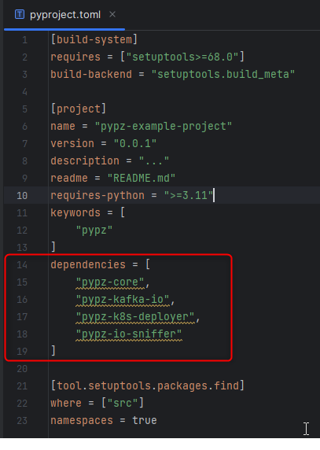

4. Install the dependencies and the current project in editable mode: ``pip install -e .``

The Plan
--------

We are going to create the following "Hello world" pipeline:

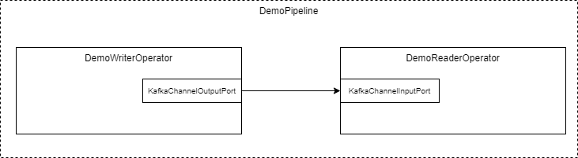

   Demo Pipeline

The `DemoWriterOperator` will produce "Hello world" messages and will transmit them over Kafka to the
`DemoReaderOperator`.

.. _demo_writer_operator:

DemoWriterOperator
------------------

1. Create a python file with the name ``writer.py``
2. Create a class with name ``DemoWriterOperator``
3. Import the necessary modules (in PyCharm either Ctrl+Space, while typing or Alt+Enter over the importable)

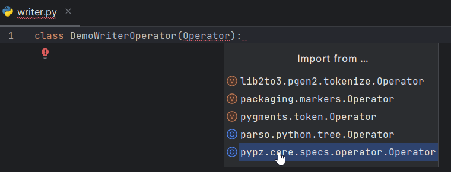

4. Generate the proper constructor (in PyCharm Alt+Insert > Override methods > select __init__ > Ok)

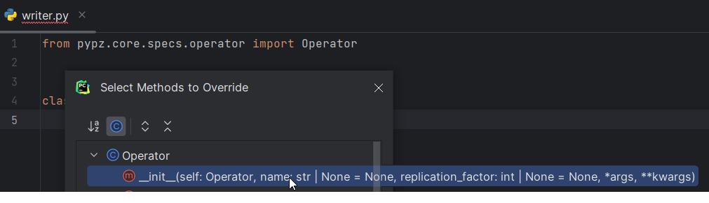

5. Generate the abstract methods (in PyCharm Alt+Insert > Implement methods > select all methods > Ok )

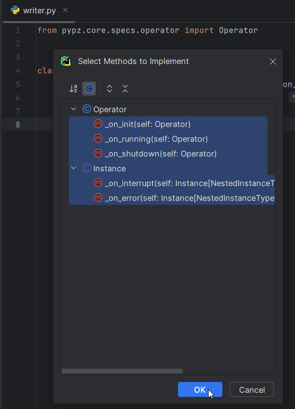

Once you are done, you should see something similar:

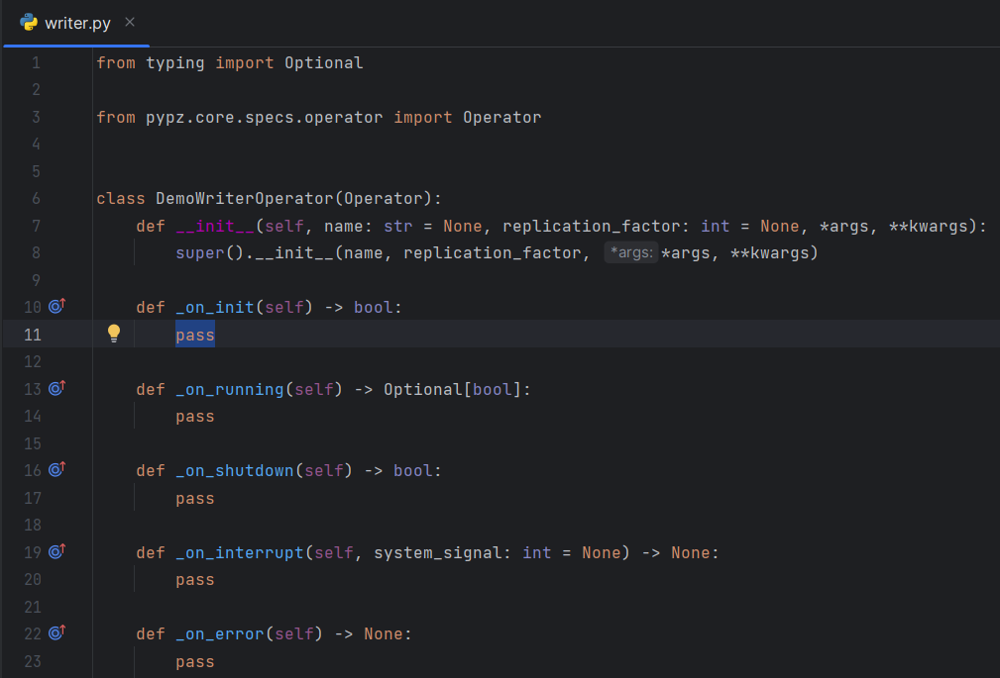

Check :ref:`models` section for more details on the methods.

Output Schema
+++++++++++++

The builtin kafka ports (:class:`KafkaChannelInputPort <pypz.plugins.kafka_io.ports.KafkaChannelInputPort>`,
:class:`KafkaChannelOutputPort <pypz.plugins.kafka_io.ports.KafkaChannelOutputPort>`)
are sending records in `Avro <https://avro.apache.org/docs/1.11.1/specification/_print/>`_
format, hence we need to define the schema for the records.

.. code-block:: python

   AvroSchemaString = """
   {
       "type": "record",
       "name": "DemoRecord",
       "fields": [
           {
               "name": "text",
               "type": "string"
           }
       ]
   }
   """

This schema will expect a record with the key "text" in type string.

*__init__()*
++++++++++++

Operators can be enhanced by plugins. For example, the :class:`Input- <pypz.core.specs.plugin.InputPortPlugin>`/
:class:`OutputPortPlugins <pypz.core.specs.plugin.OutputPortPlugin>` enable the operators
to transfer data to and from each other. Hence, we need to create the
:class:`KafkaChannelOutputPort <pypz.plugins.kafka_io.ports.KafkaChannelOutputPort>` plugin in the ctor of the operator.

.. code-block:: python

   ...

   AvroSchemaString = """
   {
       "type": "record",
       "name": "DemoRecord",
       "fields": [
           {
               "name": "text",
               "type": "string"
           }
       ]
   }
   """

   def __init__(self, name: str = None, *args, **kwargs):
       super().__init__(name, *args, **kwargs)

       self.output_port = KafkaChannelOutputPort(schema=DemoWriterOperator.AvroSchemaString)

       self.output_record_count: int = 0

   ...

Additionally, we create a variable to track, how many records have already been sent.

*_on_init()*
++++++++++++

Check :ref:`operator_methods` for the signature explanation.

This method will be called after services have been started, resources have been created and port plugins
have been initialized.

Since we are not implementing any logic here for this example, simply return True.

.. code-block:: python

   def _on_init(self) -> bool:
       return True

.. warning::
   There is an explicit type checking of the expected return values during execution, so
   **ALWAYS mind the expected return values and their types!** If you would return ``None`` here, you would get
   an error due to the unexpected return value type.

*_on_shutdown()*
++++++++++++++++

Check :ref:`operator_methods` for the signature explanation.

This method will be called before port plugin are stopped, resources deleted and services shut down.

Since we are not implementing any logic here for this example, simply return True.

.. code-block:: python

   def _on_shutdown(self) -> bool:
       return True

*_on_interrupt(system_signal)*
++++++++++++++++++++++++++++++

This method is called, if a system signal has been caught like SIGINT, SEGTERM etc. You can use it to
eventually interrupt your internal logic (e.g., loops), which is not accessible by *pypz*.
It does not expect any return value and we are not using it for this example, hence you can leave it.

*_on_error()*
+++++++++++++

This method is called, if an exception is raised during execution. You can use it to perform a reaction to
an error.

*_on_running()*
+++++++++++++++

Check :ref:`operator_methods` for the signature explanation.

This method is called after the _on_init() has successfully finished and before _on_shutdown(). It runs until:

- the method returns True **OR**
- the method returns None and there is no more records to be received on any of the
  :class:`InputPortPlugins <pypz.core.specs.plugin.InputPortPlugin>`

Since we don't have any :class:`InputPortPlugin <pypz.core.specs.plugin.InputPortPlugin>` in the writer operator,
we need to make sure that we have a termination condition i.e., at some point, we return ``True``.

The following logic is implemented:

1. We create the record according to the defined schema
2. For visualization purposes, we print it onto stdout
3. We invoke the send method of the output_port
4. If 30 records were sent, then we terminate

.. code-block:: python

   def _on_running(self) -> Optional[bool]:
       record_to_send = {
           "text": "HelloWorld_" + str(self.output_record_count)
       }

       print("Generated record: ", record_to_send)

       self.output_port.send([record_to_send])

       self.output_record_count += 1

       if 30 == self.output_record_count:
           return True

       time.sleep(1)

       return False

DemoReaderOperator
------------------

1. Create a python file with the name ``reader.py``
2. Create a class with name ``DemoReaderOperator``
3. Repeat the steps 3-5 from the :ref:`demo_writer_operator`

Once done, you should see something similar:

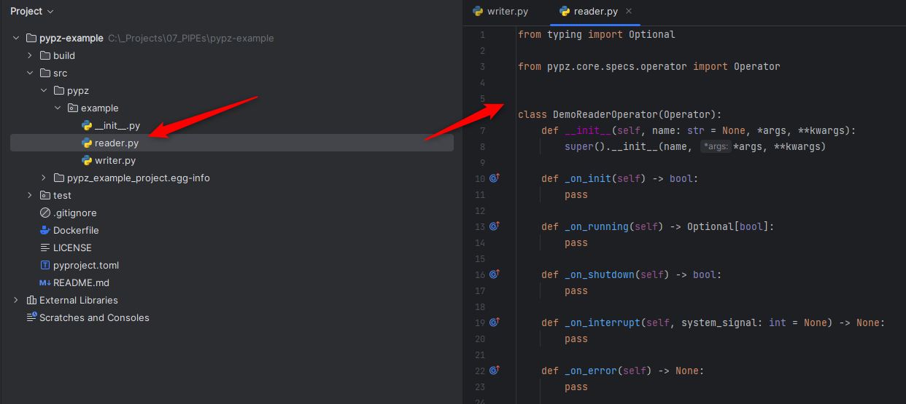

Input schema
++++++++++++

Since we are reading records from Kafka sent by the DemoWriterOperator, we need to have the same schema.

.. code-block:: python

   AvroSchemaString = """
   {
       "type": "record",
       "name": "DemoRecord",
       "fields": [
           {
               "name": "text",
               "type": "string"
           }
       ]
   }
   """

*__init__()*
++++++++++++

We need to define the :class:`KafkaChannelInputPort <pypz.plugins.kafka_io.ports.KafkaChannelInputPort>`.

.. code-block:: python

   ...

   AvroSchemaString = """
   {
       "type": "record",
       "name": "DemoRecord",
       "fields": [
           {
               "name": "text",
               "type": "string"
           }
       ]
   }
   """

   def __init__(self, name: str = None, *args, **kwargs):
       super().__init__(name, *args, **kwargs)

       self.input_port = KafkaChannelInputPort(schema=DemoReaderOperator.AvroSchemaString)

   ...

*_on_running()*
+++++++++++++++

In this method we are simply retrieving the records and printing them onto stdout.

.. code-block:: python

   def _on_running(self) -> Optional[bool]:
       records = self.input_port.retrieve()
       for record in records:
           print("Received record: ", record)
       return None

.. note::
   Notice that the method returns with None. This will force *pypz* to automatically check, if there are
   records available on any input ports. In this example it is equivalent to:

   .. code-block:: python

      return not self.input_port.can_retrieve()

DemoPipeline
------------

1. Create a new file with the name ``pipeline.py``
2. Create a class with the name ``DemoPipeline``
3. Import the modules
4. Generate the constructor

Note that we don't override or implement any other methods for the pipeline.

Once you are done, you should see something like this:

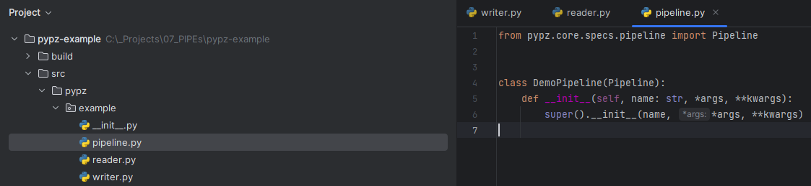

*__init__()*
++++++++++++

Since we are modelling the pipeline in the code, we need to define the operators and its connections:

.. code-block:: python

   from pypz.core.specs.pipeline import Pipeline
   from pypz.example.reader import DemoReaderOperator
   from pypz.example.writer import DemoWriterOperator

   class DemoPipeline(Pipeline):
       def __init__(self, name: str, *args, **kwargs):
           super().__init__(name, *args, **kwargs)

           self.reader = DemoReaderOperator()
           self.writer = DemoWriterOperator()

           self.reader.input_port.connect(self.writer.output_port)

.. note::
   Notice that we did not specify the name of the operator instances. In this case *pypz* will use the name
   of the variables as instance names. Check :ref:`instance_metaclass` for more information.

Congratulations, you created your first pipeline in *pypz*!

[Optional] Kafka Cluster
------------------------

Since we are using Kafka port plugins in the example, you will need ti have access to a Kafka cluster.
Should it be not the case, you can start a cluster locally from the corresponding confluent image:

.. code-block:: shell

   docker run -it -d --rm -p 9092:9092 confluentinc/confluent-local

Then you can access the Kafka broker via ``localhost:9092``.

Local execution
---------------

In this section you will learn, how to execute your pipeline locally. First, we create an additional file
with the name ``execute.py``. This will be a script file.

The following logic is implemented:

1. Create the DemoPipeline object
2. Create the :class:`PipelineExecutor <pypz.executors.pipeline.executor.PipelineExecutor>` object with the pipeline as ctor argument
3. Start the pipeline execution
4. Shutdown the pipeline execution

.. code-block:: python

   from pypz.executors.pipeline.executor import PipelineExecutor

   from pypz.example.pipeline import DemoPipeline

   if __name__ == "__main__":
       pipeline = DemoPipeline("pipeline")
       executor = PipelineExecutor(pipeline)

       executor.start()
       executor.shutdown()

.. note::
   Notice that we specified the name of the pipeline here. The reason is that automatic name deduction from
   variable names is working only within *pypz* :class:`Instance <pypz.core.specs.instance.Instance>`
   context i.e., if the caller is a type of the :class:`Instance <pypz.core.specs.instance.Instance>`.
   Check :ref:`instance_metaclass` for more information.

If you try to run your script now, you will get the following error:

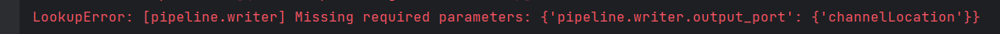

This is because the port plugins have not been configured with the Kafka broker location. To do this, we need
to set the following instance parameters:

.. code-block:: python

   from pypz.executors.pipeline.executor import PipelineExecutor

   from pypz.example.pipeline import DemoPipeline

   if __name__ == "__main__":
       pipeline = DemoPipeline("pipeline")
       pipeline.set_parameter(">>channelLocation", "localhost:9092")

       executor = PipelineExecutor(pipeline)

       executor.start()
       executor.shutdown()

.. note::
   Notice that we configured the :ref:`channels <channel_expected_parameters>` in the port plugins directly and we
   used :ref:`two-level, excluding cascading parameters <cascading_parameters>`.

If you start the executor now, you need to see something like this:

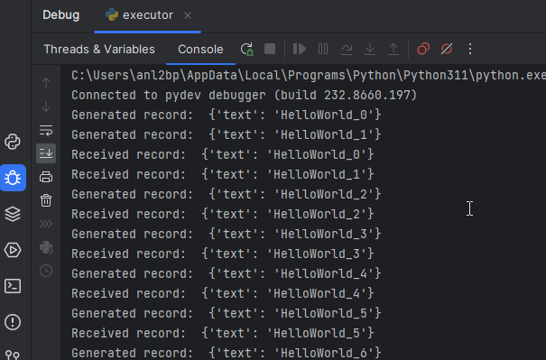

Notice that we used the print method to show some information on stdout, however there is a :ref:`logging` system
in *pypz*, which allows to send log messages. For this, we need to enhance our operators by
:class:`LoggerPlugins <pypz.core.specs.plugin.LoggerPlugin>`.
As next, we will add the :class:`DefaultLoggerPlugin <pypz.plugins.loggers.default.DefaultLoggerPlugin>`
to each operators and we will modify the code to use the
new logger. The :class:`DefaultLoggerPlugin <pypz.plugins.loggers.default.DefaultLoggerPlugin>` sends the logs to stdout.

.. code-block:: python
   :emphasize-lines: 14,23

   ...

   class DemoWriterOperator(Operator):

   ...

   def __init__(self, name: str = None, *args, **kwargs):
       super().__init__(name, *args, **kwargs)

       self.output_port = KafkaChannelOutputPort(schema=DemoWriterOperator.AvroSchemaString)

       self.output_record_count: int = 0

       self.logger = DefaultLoggerPlugin()

   ...

   def _on_running(self) -> Optional[bool]:
       record_to_send = {
           "text": "HelloWorld_" + str(self.output_record_count)
       }

       self.get_logger().info(f"Generated record: {record_to_send}")

       self.output_port.send([record_to_send])

       self.output_record_count += 1

       if 30 == self.output_record_count:
           return True

       time.sleep(1)

       return False

   ...

.. code-block:: python
   :emphasize-lines: 12,19

   ...

   class DemoReaderOperator(Operator):

   ...

   def __init__(self, name: str = None, *args, **kwargs):
       super().__init__(name, *args, **kwargs)

       self.input_port = KafkaChannelInputPort(schema=DemoReaderOperator.AvroSchemaString)

       self.logger = DefaultLoggerPlugin()

   ...

   def _on_running(self) -> Optional[bool]:
       records = self.input_port.retrieve()
       for record in records:
           self.get_logger().debug(f"Received record: {record}")
       return None

   ...

Notice as well that the default log level is ``INFO``. Since we call the debug() method in the ``DemoReaderOperator``,
we need to change the log level via setting the corresponding parameter.

.. code-block:: python
   :emphasize-lines: 6

   ...

   if __name__ == "__main__":
       pipeline = DemoPipeline("pipeline")
       pipeline.set_parameter(">>channelLocation", "localhost:9092")
       pipeline.reader.logger.set_parameter("logLevel", "DEBUG")

       executor = PipelineExecutor(pipeline)

       executor.start()
       executor.shutdown()

If you now execute the pipeline, you will see the following:

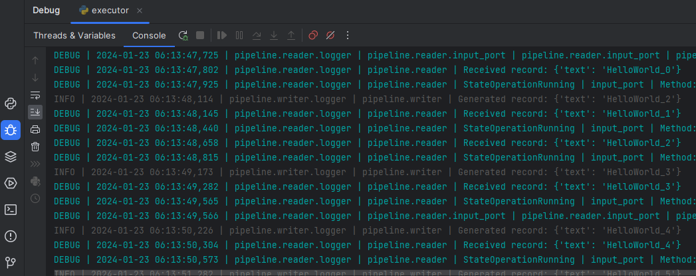

Sniffer
-------

It might be helpful to know, what the operators are doing and how many data they have processed.
:ref:`Sniffer <sniffer>` is a small tool to visualize the control plane of the operators' ports i.e., what the ports are doing.

.. warning::
   The sniffer is still in an early version. Do not expect perfect functionality or nice GUI!

1. Create an additional file with the name ``sniffer.py``, which will be a script
2. Create the pipeline object
3. Set the parameters as you have done in the ``execute.py``
4. Create the :class:`sniffer object <pypz.sniffer.viewer.PipelineSnifferViewer>` and provide the pipeline as constructor argument
5. Invoke the sniffer's mainloop() method (based on TK)

.. code-block:: python
   :emphasize-lines: 6

   from pypz.sniffer.viewer import PipelineSnifferViewer

   from pypz.example.pipeline import DemoPipeline

   if __name__ == "__main__":
       pipeline = DemoPipeline("pipeline")
       pipeline.set_parameter(">>channelLocation", "localhost:9092")
       pipeline.reader.logger.set_parameter("logLevel", "DEBUG")

       sniffer = PipelineSnifferViewer(pipeline)
       sniffer.mainloop()

6. Run ``sniffer.py``
7. Run ``execute.py``

.. image:: ../resources/images/ht_cp_sniffer_1.gif

Build + Docker
--------------

1. To build your project, you will need the ``build`` tool first:

.. code-block:: shell

   python -m pip install build

2. Then you can build your project by invoking the following command from the project root

.. code-block:: shell

   python -m build

This command will create the sdist and wheel into the **dist** folder. This is important, since the Dockerfile
references this folder.

3. Now you can build your docker image via

.. code-block:: shell

   docker build -t pypz-demo-pipeline .

.. note::
   Obviously your image tag shall be adapted so that it can be later pushed to the registry of your choice.

.. warning::
   You might get the following error messages during building the Docker image.

   .. image:: ../resources/images/ht_cp_docker_error.png

   This can have the following root causes:

   1. invalid DNS configuration -> check /etc/resolv.conf on linux
   2. you are behind a proxy, but the Docker engine does not know about it -> check ~/.docker/config.json

   To include proxy during Docker build you need to modify the ~/.docker/config.json file by adding the following
   configuration to it:

   .. code-block:: json

      "proxies": {
        "default": {
          "httpProxy": "HTTP_PROXY_HOST:PORT",
          "httpsProxy": "HTTP_PROXY_HOST:PORT",
          "noProxy": "localhost,127.0.0.*"
        }
      }

   Then restart the Docker engine.

4. (optional) If you have a Docker image registry, then you can push the built image
5. Now you can set the ``operatorImageName`` parameter for both operators

.. code-block:: python
   :emphasize-lines: 13,14

   from pypz.core.specs.pipeline import Pipeline
   from pypz.example.reader import DemoReaderOperator
   from pypz.example.writer import DemoWriterOperator

   class DemoPipeline(Pipeline):
       def __init__(self, name: str, *args, **kwargs):
           super().__init__(name, *args, **kwargs)

           self.reader = DemoReaderOperator()
           self.writer = DemoWriterOperator()

           self.reader.set_parameter("operatorImageName", "pypz-demo-pipeline")
           self.writer.set_parameter("operatorImageName", "pypz-demo-pipeline")

           self.reader.input_port.connect(self.writer.output_port)

This is important, if you want to deploy your pipeline, since the deployer will use the provided image name to
start the proper container with your project embedded in it.

Deploy to Kubernetes
--------------------

The following section will show, how to deploy your pipeline to Kubernetes.

Prepare local deployment with Kind (optional)
+++++++++++++++++++++++++++++++++++++++++++++

If you have no access to a Kubernetes cluster, you can use `Kind <https://kind.sigs.k8s.io>`_ locally.

.. important::
   Kind is for testing and demonstration purposes, it should not be used for productive workloads!

1. Please follow the instruction to install `Kind <https://kind.sigs.k8s.io>`_ on your machine.
2. Start your cluster.

.. code-block:: shell

   kind create cluster

3. (optional) If you have no access to a Docker image registry, then load the image into the cluster

.. code-block:: shell

   kind load docker-image pypz-demo-pipeline

.. note::
   Note that there is a way to start a registry on Kind, however this guide does not cover that.

Now your cluster is ready, you can follow the rest of the guide.

Kubernetes configuration (optional)
+++++++++++++++++++++++++++++++++++

To make the Kubernetes deployer work in *pypz*, it requires the Kubernetes configuration file.
There are different ways, how to obtain it depending on the cluster management, however if you
installed Kind, then the necessary config file is already prepared under ~/.kube/config.

Certificates (optional)
+++++++++++++++++++++++

If your cluster has a not commonly accepted certificate, then you need to import it into the certificate
store of the python. *pypz* uses ``certifi``. To get the location of the cacert file, you can execute
the following:

.. code-block:: shell

   python -c "import certifi; print(certifi.where())"

Then import your certificates into that cacert file.

KubernetesDeployer
++++++++++++++++++

#. Create an additional file with the name ``deploy.py``, which will be a script
#. Create the pipeline object
#. Set the necessary parameters
#. Create the :class:`KubernetesDeployer <pypz.deployers.k8s.KubernetesDeployer>` and specify the namespace
#. Deploy the pipeline only, if it is not yet deployed
#. Attach to the deployed pipeline to block until it is finished
#. Destroy the pipeline and its related resources

.. code-block:: python

   from pypz.deployers.k8s import KubernetesDeployer

   from pypz.example.pipeline import DemoPipeline

   if __name__ == "__main__":
       pipeline = DemoPipeline("pipeline")
       pipeline.set_parameter(">>channelLocation", "localhost:9092")
       pipeline.reader.logger.set_parameter("logLevel", "DEBUG")

       deployer = KubernetesDeployer(namespace="default")

       if not deployer.is_deployed(pipeline.get_full_name()):
           deployer.deploy(pipeline)

       deployer.attach(pipeline.get_full_name())
       deployer.destroy(pipeline.get_full_name())

Run ``sniffer.py``

Run ``deploy.py``

Play with Replication
---------------------

You can :ref:`replicate <operator_replication>` operators by setting the replication factor as parameter.
Modify your ``deploy.py`` file:

.. code-block:: python
   :emphasize-lines: 10,11

   from pypz.deployers.k8s import KubernetesDeployer

   from pypz.example.pipeline import DemoPipeline

   if __name__ == "__main__":
       pipeline = DemoPipeline("pipeline")
       pipeline.set_parameter(">>channelLocation", "localhost:9092")
       pipeline.reader.logger.set_parameter("logLevel", "DEBUG")

       pipeline.reader.set_parameter("replicationFactor", 3)
       pipeline.writer.set_parameter("replicationFactor", 3)

       deployer = KubernetesDeployer(namespace="default")

       if not deployer.is_deployed(pipeline.get_full_name()):
           deployer.deploy(pipeline)

       deployer.attach(pipeline.get_full_name())
       deployer.destroy(pipeline.get_full_name())

.. warning::
   If you would deploy the pipeline with replicated operators and start the sniffer from ``sniffer.py``,
   you would not see the replicated operators in Sniffer, since the pipeline object created in the ``sniffer.py`` file
   has no replicated operators.

You can either set the parameters as well in ``sniffer.py``, but in this case every time you change something in
the deployed pipeline, you need to replicate the change into your ``sniffer.py``.

There is a more robust solution for that. Instead of creating the sniffed pipeline manually, we can use the
KubernetesDeployer to retrieve the deployed pipeline for us, which then can be used to sniff.

Adapt the ``sniffer.py`` accordingly.

.. code-block:: python

   from pypz.sniffer.viewer import PipelineSnifferViewer

   from pypz.deployers.k8s import KubernetesDeployer

   if __name__ == "__main__":
       deployer = KubernetesDeployer(namespace="default")
       pipeline = deployer.retrieve_deployed_pipeline("pipeline")

       sniffer = PipelineSnifferViewer(pipeline)
       sniffer.mainloop()

Now you can run the scripts:

1. ``deploy.py``
2. ``sniffer.py``

Mind the order, since unlike in the previous cases, sniffer cannot be executed before the pipeline has
been deployed, since now it relies on the deployed configuration.

If everything is ok, you should see something like this:

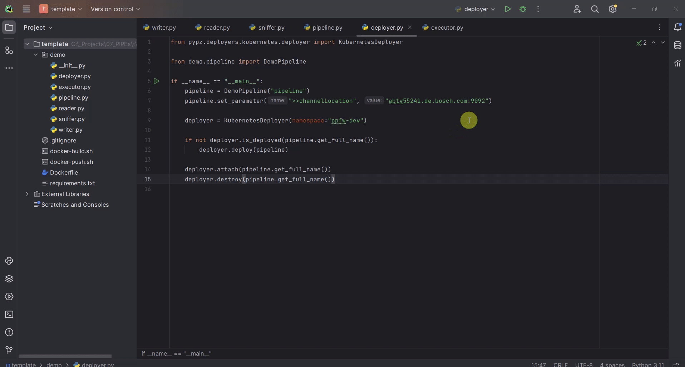

Additional Optimizations
------------------------

Expected Parameters
+++++++++++++++++++

In the ``DemoWriterOperator`` we are using hardcoded values for both the message and the maximal record count.
These values should actually be parameters that the user can set from outside, so we are introducing the following
:ref:`expected_parameters`:

- recordCount, which will be a required parameter
- message, which will be an optional parameter with the default value of "HelloWorld"

Adapt the code in the ``writer.py`` file:

.. code-block:: python
   :emphasize-lines: 14,15,16,27,32,41,50

   import time
   from typing import Optional

   from pypz.core.commons.parameters import OptionalParameter, RequiredParameter
   from pypz.core.specs.operator import Operator
   from pypz.plugins.kafka_io.ports import KafkaChannelOutputPort
   from pypz.plugins.loggers.default import DefaultLoggerPlugin

   class DemoWriterOperator(Operator):

       ...

       record_count = RequiredParameter(int, alt_name="recordCount",
                                        description="Specifies number of records to send")
       message = OptionalParameter(str, description="Specifies the message prefix for the record")

       def __init__(self, name: str = None, *args, **kwargs):
           super().__init__(name, *args, **kwargs)

           self.output_port = KafkaChannelOutputPort(schema=DemoWriterOperator.AvroSchemaString)

           self.output_record_count: int = 0

           self.logger = DefaultLoggerPlugin()

           self.record_count = None
           """
           Since it is a required parameter, the initial value does not matter.
           """

           self.message = "HelloWorld"
           """
           This is an optional parameter, the default value is the initial value of the variable.
           """

       ...

       def _on_running(self) -> Optional[bool]:
           record_to_send = {
               "text": f"{self.message}_{self.output_record_count}"
           }

           self.get_logger().info(f"Generated record: {record_to_send}")

           self.output_port.send([record_to_send])

           self.output_record_count += 1

           if self.record_count == self.output_record_count:
               return True

           time.sleep(1)

           return False

       ...

Then you can set the parameters outside of the pipeline in either ``execute.py`` or ``deploy.py``.

.. code-block:: python

   pipeline.writer.set_parameter("recordCount", 30)
   pipeline.writer.set_parameter("message", "Other message")